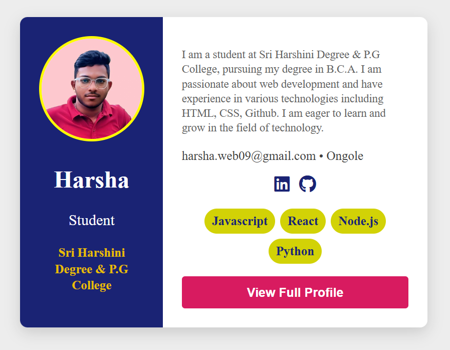

# Profile Card - HTML & CSS Project

A clean and modern profile card built using **HTML** and **CSS**. This project showcases a personal profile, including photo, contact info, education, skills, and social media links — styled with Flexbox and responsive-friendly structure (to be improved later).

## 🔗 Live Demo

👉 [View Project Live](https://harshaweb09.github.io/profile-card/)  

---

## 📸 Preview

  

---

## 🛠️ Built With

- HTML5
- CSS3 (Flexbox)
- Font Awesome (Icons)

---

## 📂 Project Features

- Clean and structured layout
- Flexbox-based card design
- Responsive layout foundation
- Hover effects on social icons and buttons
- Highlighted skills section

---

## 📬 Contact

**Harsha Vardhan Reddy Katari**  
📧 harsha.web09@gmail.com  
🌐 [LinkedIn](https://www.linkedin.com/in/harsha-vardhan-reddy-katari/) | [GitHub](https://github.com/harshaweb09)
